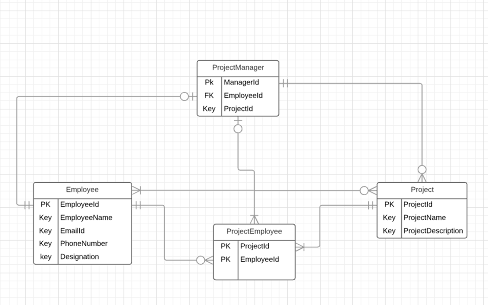

# Office App (NodeJs)

==========================

### Pre-Requiste

Node(v8.10), Mysql up and running

## Setup

---

1.  Clone the Repo/Download Zip

2.  Go inside the project directory

    ```sh
    $ cd office-app
    ```

3.  Install Dependencies

    ```sh
    $ npm install
    ```

4.  Update Configuration Values in .env file with currect DB Config.

5.  ### Setting Up DataBase

    The project uses knex for connecting to mysql.
    Simply Run the following commands to create Tables and DummyData in your connected MYSQL DB.

        1.  Install Knex globally

            ```sh
            $ npm install -g knex
            ```

        2.  Run the Migration Script to Create Tables and Dummy Database.
            Simply run the following command inside the office-app/

            ```sh
            $ knex migrate:latest
            ```

    After running the command you can check the db, the data must have been created.
    Visit http://knexjs.org/#Migrations for full description on knex migration

6)  ### Start The APP

    Once you have applied the migration , start the app

    ```sh
    $ npm start
    ```

7)  (Optional) Install nodemon for automatic restart of server on code changes.

    `sudo npm install -g nodemon`

    `nodemon start`

### Rollback the last batch of migrations

```sh
$ knex migrate:rollback
```

In Case of any query contact,
Pulankit Panjwani
[Email:pulankit@gmail.com](mailto:pulankit@gmail.com)
PhoneNumber:+919760252857

## DataBase Design

The Project Contains four tables

1.  Employee
2.  Project
3.  Manager
4.  ProjectEmployee

The following is the Relationship Diagram:



## Important Points

- A Manager can have one or more projects.
- A Project can only have one manager and multiple employees.
- Deleting Manager updates sets ProjectManager in Project Table as null, for related records
- Deleting Employees deletes corresponding record in ProjectEmployee Table and Manager Table
- A Manager of the project cannot be added as an employee.

## API Docs

Please refer [API DOCS](./APIDOC.MD)
